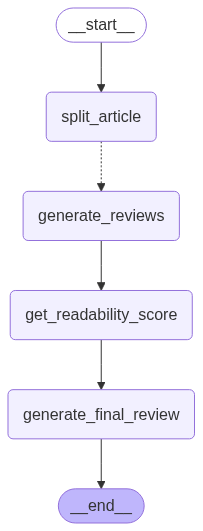

# Documenation Suggestion giver(Task 1)
In this project i implement an ai agent that can scrape any article (under https://help.moengage.com/hc/en-us/articles/...) and provide suggestion. This is the task 1 of the given assignment.
## Table of Content
- [Project demonstraction wxamples](#project-demonstraction)
- [Tech stack](#tech-stack)
- [How to run](#how-to-run)
- [Implementation](#implementation)
- [Challenges Faced](#challenges-faced)

## Project demonstraction
### 1. Example
**link**: https://help.moengage.com/hc/en-us/articles/115002571883-Suggest-a-Feature

```
curl http://localhost:8000/suggestion?url=https://help.moengage.com/hc/en-us/articles/115002571883-Suggest-a-Feature
```

Response
```
{
    "readability": "Flesch-Kincaid reading ease score: -20.01. \nThe score is bad.\n\nOverall rating of the readability of the article: 7.8/10.\n\n## Sentences that are difficult to understand:\n\n### How Does This Help?\n* None\n\n### Submit a Product Idea\n* None\n\n### Feature Status\n* \"This request was not clear, already exists, or is not in alignment with where we are taking our product.\"\n Suggested rephrase: \"This request was declined because it was unclear, already exists, or doesn’t align with our product roadmap.\"\n\n### Your Feedback\n* \"Only .jpeg, .png files below1MB\"\n Suggested rephrase: \"Only .jpeg, .png files below 1MB\"\n\n### Feature Statuslink > Privacy Preference Center\n* \"However, blocking some types of cookies may impact your experience of the site and the services we are able to offer.\"\n Suggested rephrase: \"However, blocking some types of cookies might affect how you use our site and what features are available to you.\"\n* \"They may be used by those companies to build a profile of your interests and show you relevant adverts on other sites.\"\n Suggested rephrase: \"These cookies help our advertising partners understand your interests and show you relevant ads.\"\n* \"All information these cookies collect is aggregated and therefore anonymous.\"\n No suggested rephrase, but an example or analogy would be helpful.\n\n### Feature Statuslink > Privacy Preference Center > Cookie List\n* The text surrounding the image \"Powered by Onetrust\" is not clear.\n Suggested addition: A brief description of what \"Powered by Onetrust\" means and its relevance to the platform.\n\n## General Suggestions\n\n* Provide brief descriptions or context for technical terms and concepts, such as \"product team and leadership\" and \"Onetrust\".\n* Use simple and concise language throughout the article.\n* Consider adding screenshots and examples to illustrate complex concepts and make the content more accessible to non-technical marketers. \n\nBased on the given reviews, most sections have a readability rating of 8/10, indicating that they are generally easy to understand. However, some sentences and technical terms may require clarification or rephrasing to make the content more accessible to non-technical marketers. The section \"Feature Statuslink > Privacy Preference Center\" and \"Feature Statuslink > Privacy Preference Center > Cookie List\" have lower readability ratings, suggesting that these areas may require more attention to improve clarity and comprehension.",
    "completeness": "**Overview**\n\nThe article provides a comprehensive guide to the feature request system in MoEngage, but it lacks detailed information and examples in some sections. Based on the reviews, the overall completeness rating of the article is **6.5/10**.\n\n**Does the article provide enough detail for a user to understand and implement the feature or concept?**\n\nNo, the article does not provide enough detail for a user to fully understand and implement the feature or concept. While some sections, such as \"Submit a Product Idea\", provide clear and concise instructions, others, like \"Feature Statuslink > Privacy Preference Center > Cookie List\", lack explanatory text and require additional context.\n\n**Sections that require examples and type of examples needed**\n\nThe following sections require examples to improve clarity:\n\n1. **Suggest a Feature**: An example of a feature request, such as \"improving the user interface\" or \"adding a new segmentation filter\", would help users understand the type of features that can be suggested and how to phrase their requests.\n2. **How Does This Help?**: An example of a scenario where a user suggests a feature and MoEngage's product team reviews and responds to it would illustrate the process.\n3. **Submit a Product Idea**: A sample product idea or feature request with a detailed description, current workaround, and product area selection would help illustrate the type of information MoEngage is looking for.\n4. **Feature Statuslink**: An example of a feature request going through different statuses (e.g., Awaiting Feedback -> Planned -> Building -> Released) would help illustrate the process.\n5. **Feature Statuslink > Privacy Preference Center**: A step-by-step guide on how to configure cookie settings or a screenshot of the Privacy Preference Center dashboard within the MoEngage platform would be helpful.\n6. **Feature Statuslink > Privacy Preference Center > Manage Consent Preferences**: An example of how to manage consent preferences for each type of cookie, such as disabling Targeting Cookies, would make the section more actionable.\n7. **Feature Statuslink > Privacy Preference Center > Cookie List**: A step-by-step guide on how to manage cookie preferences using the provided options (e.g., searching, filtering, and applying consent) would be helpful.\n\n**Specific suggestions for improvement**\n\n* Add concrete examples to illustrate complex concepts and processes.\n* Provide step-by-step guides for key tasks, such as managing cookie preferences and submitting feature requests.\n* Include screenshots or images to help users visualize the features and processes.\n* Consider adding a brief overview of the feature request process and what happens after a feature is suggested.",
    "structure": "**Overview**\n\nThe article provides a general overview of the feature request system in MoEngage, but it lacks detailed information on how to suggest a feature, what types of features can be suggested, and how the feature request process works. Based on the reviews of each section, the overall completeness rating of the article is **6.5/10**.\n\n**Does the article provide enough detail for a user to understand and implement the feature or concept?**\n\nNo, the article does not provide enough detail for a user to understand and implement the feature or concept. While some sections, such as \"Submit a Product Idea\" and \"Manage Consent Preferences\", provide clear and concise information, others, such as \"Suggest a Feature\" and \"Cookie List\", lack detailed information and examples.\n\n**Sections that require examples and what type of example needed**\n\nThe following sections require examples:\n\n1. **Suggest a Feature**: An example of a suggested feature, such as \"enhance user segmentation\" or \"improve campaign analytics\", would help illustrate the practical application of the feature request system.\n2. **How Does This Help?**: An example of a scenario where a customer's suggested feature was prioritized and implemented would help illustrate the process and make it more relatable for non-technical marketers.\n3. **Submit a Product Idea**: A sample product idea submission with a clear title, detailed description, and a relevant product area would help illustrate the type of information that should be included in each field.\n4. **Feature Status**: An example of a scenario where a user submits a feature request and it goes through different statuses (e.g., Awaiting Feedback -> Planned -> Building -> Released) would help illustrate the process and make it more relatable for non-technical marketers.\n5. **Feature Statuslink > Privacy Preference Center**: A brief description of what a \"Feature Statuslink\" looks like and how it is used in the MoEngage platform would help provide context.\n6. **Feature Statuslink > Privacy Preference Center > Cookie List**: A brief description of how to configure cookie preferences or a sample use case for the Cookie List feature would help illustrate the practical application of the feature.\n\nThe following sections have examples that can be improved:\n\n1. **Manage Consent Preferences**: An example of how to manage consent preferences for each type of cookie, such as \"For instance, if a user wants to disable Targeting Cookies, they can follow these steps: [provide steps]\".\n2. **Feature Statuslink > Privacy Preference Center > Manage Consent Preferences**: An example of how the Manage Consent Preferences feature works in practice, such as \"When a user clicks on the 'Manage Consent Preferences' button, they will see a pop-up with the following options: [provide options]\".",
    "style_guide": "**Overview of the article alignment with style guide: 7.2/10**\n\nThe article provides clear and concise information about suggesting a feature, submitting a product idea, and feature status. However, there are areas that need improvement to better align with the style guide.\n\n**Sections that are not very aligned to style guide:**\n\n1. **Privacy Preference Center** (Rating: 4/10)\n\t* The section seems out of place and not directly relevant to the use or setup of the MoEngage customer engagement platform.\n\t* Suggestion: Tailor the content to directly relate to MoEngage and its implications for the user. Simplify language and provide clear actions or steps related to setting up or using the MoEngage platform.\n\t* Example: \"Manage Your Cookie Preferences: To ensure our website works properly, we use strictly necessary cookies. Learn how to manage your cookie preferences and ensure a seamless experience with MoEngage.\"\n2. **Cookie List** (Rating: 2/10)\n\t* The section lacks a clear and concise description of what the user is seeing or what actions they need to take.\n\t* Suggestion: Add a brief description of the Cookie List feature, its purpose, and instructions on how to use it. Use action-oriented language to guide the user effectively.\n\t* Example: \"The Cookie List section allows you to manage cookies and consent preferences. To configure your preferences: 1. Use the search icon to find specific cookies. 2. Filter cookies using the filter icon. 3. Clear your selections using the clear checkbox.\"\n3. **How can we improve this article?** (Rating: 6/10)\n\t* The section seems to be a feedback form, but it could be more customer-focused and engaging.\n\t* Suggestion: Add a brief introduction to set the context for the feedback form. Use more descriptive labels for the options and consider adding a character limit for the comments field.\n\t* Example: \"We value your input! Please help us improve this article by providing your feedback. What did you think of this article? [Select an option]\"\n\n**Additional suggestions:**\n\n* Use a more conversational tone throughout the article to make it more engaging and customer-focused.\n* Consider adding visual elements, such as screenshots or icons, to break up the text and make it more engaging.\n* Use action-oriented language to guide the user effectively and encourage them to take specific actions.\n\n**Sections that are well-aligned with style guide:**\n\n* **Suggest a Feature** (Rating: 8/10)\n* **Submit a Product Idea** (Rating: 8/10)\n* **Feature Status** (Rating: 8/10)\n* **How Does This Help?** (Rating: 8/10)\n* **Manage Consent Preferences** (Rating: 8/10)\n\nThese sections provide clear and concise information, use a customer-focused tone, and guide the user effectively. However, there is always room for improvement, and the suggestions provided can help further enhance the article's alignment with the style guide."
}
```

### Example 2

**link**: https://help.moengage.com/hc/en-us/articles/360000347066-Tracking-Users-in-Flows%23h_01HV6692KWH361Q3RPX3SQ1RHN
```
curl http://localhost:8000/suggestion?url=https://help.moengage.com/hc/en-us/articles/360000347066-Tracking-Users-in-Flows%23h_01HV6692KWH361Q3RPX3SQ1RHN
```
```
{
    "readability": "Flesch-Kincaid reading ease score: -20.84. This score indicates that the article is very difficult to read, which is bad.\n\nOverall rating of the readability of the article based on given ratings and reviews: \nReadability Rating (as a Non-Technical Marketer): 7/10\n\nList of sentences that I, as a non-technical marketer, find difficult to understand:\n\n### Tracking Users in Flows\n* \"conversion attribution\" and \"visualize user trips\" are used without explanations\n* The section seems to lack a brief introduction or overview of what tracking users in flows entails\n\n### Tracking Users Who Entered a Flow\n* \"The event is tracked for each entry done by a user.\" could be rephrased \n* \"By filtering using **With control group \\\\=** **True**, ...\" and similar sentences may be confusing \n\n### Tracking Users Who Converted\n* \"The event is tracked for each conversion, so if a user performs the conversion multiple times during their flow trip, this event will be raised for each recorded conversion and also for each of the defined goals.\"\n* \"By filtering using **Flow Id**, you can find the list of unique users whose conversion was attributed to this flow.\"\n\n### Privacy Preference Center\n* \"When you visit any website, it may store or retrieve information on your browser, mostly in the form of cookies.\"\n* \"This information might be about you, your preferences or your device and is mostly used to make the site work as you expect it to.\"\n\n### Manage Consent Preferences\n* \"They may be used by those companies to build a profile of your interests and show you relevant adverts on other sites.\"\n* \"All information these cookies collect is aggregated and therefore anonymous.\"\n\n### Privacy Preference Center > Cookie List\n* The entire section seems to be a list of checkboxes and labels, which doesn’t form coherent sentences.\n* The presence of technical terms like \"Leg.Interest\" and \"Powered by Onetrust\" makes it hard to comprehend.\n\nSuggestions for clearer alternatives:\n\n### Tracking Users in Flows\n* Add a brief introduction to explain the importance of tracking users in flows and how it helps marketers.\n* Provide simple explanations for technical terms \n\n### Tracking Users Who Entered a Flow\n* Rephrase to \"The event is triggered every time a user enters the flow.\"\n* Provide a brief definition of \"control group\" and its relevance to the flow.\n\n### Tracking Users Who Converted\n* Simplify explanation: \"Every time a user converts, we track it. If a user converts multiple times, we'll track each conversion.\"\n* Add a brief explanation or a tooltip for \"Flow Id\"\n\n### Privacy Preference Center\n* Rephrase to: \n  * \"When you visit our website, we may save some information on your browser using cookies.\"\n  * \"This information helps us understand how to make our site work better for you.\"\n\n### Manage Consent Preferences\n* Simplify by using: \n  * \"These cookies help our advertising partners understand your interests and show you relevant ads on other sites.\"\n  * \"These cookies collect information in a way that doesn't identify you personally.\"\n\n### Privacy Preference Center > Cookie List\n* Provide a brief explanation of what the Privacy Preference Centerlink is and its purpose.\n* Use simpler language to describe the options and their implications.",
    "completeness": "**Overview**\n\nThe article \"Tracking Users in Flows\" has been reviewed for completeness, and the overall rating is 6.5/10. The article provides a good overview of the topic, but it lacks detailed information and examples in several sections. The reviews suggest that the article assumes some technical knowledge and does not provide enough context for non-technical marketers.\n\n**Does the article provide enough detail for a user to understand and implement the feature or concept?**\n\nNo, the article does not provide enough detail for a user to understand and implement the feature or concept. The reviews highlight that several sections lack clear explanations, and some technical terms are not defined.\n\n**Sections that require examples and suggested improvements**\n\nThe following sections require examples or improvements:\n\n1. **Tracking Users in Flows**\n\t* Completeness Rating: 6/10\n\t* Required example: A step-by-step guide on how to track users in flows, including screenshots or a real-life scenario.\n2. **Tracking Users Who Entered a Flow**\n\t* Completeness Rating: 8/10\n\t* Suggested improvement: Add a concrete example of how to use the \"User Entered Flow\" event to segment users, including a screenshot or mockup of the MoEngage interface.\n3. **Tracking Users Who Converted**\n\t* Completeness Rating: 8/10\n\t* Suggested improvement: Add a concrete example with actual values (e.g., \"Flow Id:12345\", \"Flow Name: Welcome Flow\") and a visual representation or screenshot of where to find these event attributes in the MoEngage platform.\n4. **Tracking Users Who Exited a Flow**\n\t* Completeness Rating: 8/10\n\t* Suggested improvement: Add a real-world scenario or a step-by-step guide on how to set up the segments and filters in the MoEngage platform, including an example of how to track users who exited a flow due to a specific reason.\n5. **How can we improve this article?**\n\t* Completeness Rating: 0/10\n\t* Required example: A step-by-step guide on how to track users who exited a flow link, including screenshots or a use case scenario.\n6. **Privacy Preference Center**\n\t* Completeness Rating: 2/10\n\t* Required example: A description of how user tracking works in flows, or an example of how to set up tracking for users in a flow.\n7. **Manage Consent Preferences**\n\t* Completeness Rating: 8/10\n\t* Suggested improvement: Add a screenshot or a step-by-step guide on how to manage consent preferences for users in the MoEngage platform, specifically in relation to flows and cross-channel messaging.\n\nOverall, the article requires more detailed explanations, examples, and visual aids to help non-technical marketers understand and implement the features and concepts related to tracking users in flows.",
    "structure": "**Overview**\n\nThe article \"Tracking Users in Flows\" has been reviewed for completeness, and the overall rating is 6.5/10. The article provides a good overview of tracking users in flows, but it lacks detailed information and examples to make it easier for non-technical marketers to understand and implement the feature.\n\n**Does the article provide enough detail for a user to understand and implement the feature or concept?**\n\nNo, the article does not provide enough detail for a user to understand and implement the feature or concept. The article assumes prior knowledge of certain terms and concepts, and it lacks concrete examples and step-by-step guides to make the explanations more tangible.\n\n**Sections that require examples and what type of example needed**\n\nThe following sections require examples:\n\n1. **Tracking Users in Flows**\n\t* Type of example needed: A step-by-step guide on how to track users in flows, including screenshots or a real-life scenario.\n\t* Example: \"For instance, if a user abandons their cart, you can track their journey through the flow and send them personalized notifications to encourage them to complete the purchase.\"\n2. **Tracking Users Who Entered a Flow**\n\t* Type of example needed: A concrete example of how to use the \"User Entered Flow\" event to segment users.\n\t* Example: \"Suppose we want to track users who entered Flow A. We can create a segment using the 'User Entered Flow' event and filter by Flow Id =6616a9259670a17eec8b7c65. This would give us a list of unique users who entered Flow A.\"\n3. **Tracking Users Who Converted**\n\t* Type of example needed: A concrete example with actual numbers and data to make the explanation more relatable and easier to understand.\n\t* Example: \"For a flow with 1000 users, where 100 users converted, the 'Segment Converted User' can be used to identify the 100 converted users and analyze their behavior further.\"\n4. **Tracking Users Who Exited a Flow**\n\t* Type of example needed: A concrete example of a use case where tracking users who exited a flow is useful.\n\t* Example: \"You can use this feature to retarget users who abandoned their shopping cart.\"\n5. **How can we improve this article?**\n\t* Type of example needed: A step-by-step guide on how to track users who exited a flow link, including screenshots or a use case scenario.\n6. **Privacy Preference Center**\n\t* Type of example needed: An example of how MoEngage handles user tracking in flows while respecting users' privacy preferences.\n\t* Example: \"For instance, if a user opts out of Targeting Cookies, MoEngage will not use their browsing history to personalize ads in their flows.\"\n7. **Manage Consent Preferences**\n\t* Type of example needed: An example of how to apply the different types of cookies used by MoEngage in a real-world scenario.\n\t* Example: \"For instance, if a user opts out of Targeting Cookies, MoEngage will not use their browsing history to personalize ads in their flows.\"\n\nThe **Cookie List** section does not require an example, as it appears to be a cookie consent management interface that is not directly related to the topic of tracking users in flows.",
    "style_guide": "**Overview of the article alignment with style guide:**\nThe article \"Tracking Users in Flows\" has an overall rating of 7.5/10 in terms of alignment with the style guide. The article is well-structured and easy to follow, but there are areas that could be improved to make it more customer-focused, clear, concise, and action-oriented.\n\n**Section-wise ratings and suggestions:**\n\n1. **Tracking Users Who Entered a Flow**: 8/10\n\t* The section is well-written and easy to follow, but could benefit from a brief introduction to explain why tracking users who entered a flow is important.\n\t* Suggestion: Add a brief introduction to explain the benefits of tracking users who entered a flow.\n2. **Tracking Users Who Converted**: 8/10\n\t* The section is clear, but some sentences are long and could be broken up.\n\t* Suggestion: Break up long sentences and use simpler language to explain technical terms like \"Flow Trip conversion\" and \"attribution logic\".\n3. **Tracking Users Who Exited a Flow**: 8/10\n\t* The section is well-written, but could benefit from a clear call-to-action (CTA) or next steps.\n\t* Suggestion: Add a CTA or next steps, e.g., \"Now that you know how to track users who exited a flow, you can use this information to retarget them through campaigns. Learn more about creating campaigns [link].\"\n4. **How can we improve this article?**: 2/10\n\t* The section appears to be a generic feedback form and does not provide any information related to the topic.\n\t* Suggestion: Remove the feedback form from this section and place it at the end of the article or in a separate section. Replace it with content that explains how to track users who exited a flow link.\n5. **Privacy Preference Center**: 4/10\n\t* The section does not align well with the style guide and appears to be a technical implementation of a cookie consent management system.\n\t* Suggestion: Remove this technical interface from the documentation article, as it's not relevant to the topic. Replace it with content that explains how to track users in flows, with a customer-focused tone and clear, concise language.\n6. **Manage Consent Preferences**: 6/10\n\t* The section provides information about different types of cookies and their purposes, but seems to deviate from the topic of using the MoEngage customer engagement platform.\n\t* Suggestion: Make the content more relevant to using the MoEngage platform, specifically in the context of analyzing flows. Use a more customer-focused tone and language.\n7. **Cookie List**: 2/10\n\t* The section appears to be a cookie consent management interface and does not provide any information related to the topic.\n\t* Suggestion: Remove this technical interface from the documentation article, as it's not relevant to the topic. Replace it with content that explains how to track users in flows, with a customer-focused tone and clear, concise language.\n\n**Overall rating:** 7.5/10\n\nThe article has some areas that need improvement, particularly in terms of clarity, conciseness, and action-oriented language. By addressing these areas and providing more customer-focused content, the article can better align with the style guide and provide a more helpful and user-friendly experience."
}
```

## Tech Stack
I have used python to implement the ai agent.
1. Selenium: To fetch the article html.
2. Beautiful Soup: For extracting article from html
3. Langchain and Langgraph: To Build the Agent.
4. LLM api: Used [groq api](https://console.groq.com/docs/models)
5. Docker: To containerize and run the application in an isolated environment.


## How to Run
System Requirement: **Docker** must be installed on you machine
- In terminal make you current dir as root of this repo and run following command:
```
$ docker compose up
```

- The agent server will listen at http://localhost:8000/


## Implementation
1. Visit MoEngage article URL (https://help.moengage.com/hc/en-us/articles/...). It then downloads the article HTML content. 
2. Converts article from html to markdown format.
3. *Ai agent execution*: The same agent is executed interatively for each criterion provided in the assignment, wtih corresponding criterion prompt. Following operation are perform inside the agent:

    a. **Split_article:** Article is split into section based on heading.

    b. **Generate_reviews:** For each section, review based on criterion is generated with use of llm.

    c. **Get readability score:** Calculate Flesch-Kincaid reading ease score on the article.

    d. **Generate final review:** All reviews generate for sections and consolidated and final review generate using llm.



## Challenges faced
- Prompt Sensitivity: LLM responses varied based on minor prompt changes, requiring tuning for consistency.

- Rate Limits: LLM API rate limits hit due to multiple api calls, t avoid the rate of api hit is decreased that leads to shower response generation.